# Prompt:

In this attached XML file corresponding to the Tableau report, can you try to migrate the report visualizations and dashboards to Power BI? Explain the specific approaches that you would use in migrating the report visualizations and dashboards.

---
---

# Response:

Certainly! Migrating Tableau report visualizations and dashboards to Power BI involves a systematic approach to ensure that all components—from data connections and calculated fields to visual representations and interactivity—are accurately replicated or enhanced. Below, I outline **specific approaches** for migrating the visualizations and dashboards from your provided Tableau XML file to Power BI, complemented by **small Mermaid diagrams** for clarity and easy inclusion in client presentations.

---

## **1. Understanding the Tableau XML Structure**

Before diving into the migration, it's essential to comprehend the key components defined in the Tableau XML file:

- **Workbook Structure:** Defines the overall settings, platform, and version.
- **Data Sources:** Includes connections to external data (e.g., Excel files) and inline data sources (e.g., Parameters).
- **Calculated Fields:** Custom calculations used in the report (e.g., Profit Ratio).
- **Groups and Hierarchies:** Logical groupings and drill-down paths (e.g., Location Hierarchy).
- **Worksheets:** Individual report pages (e.g., Profit Map, Sales by Category).
- **Layout and Styling:** Defines the arrangement and visual styling of elements.
- **Aliases:** Simplified names for complex field values.

---

## **2. Migration Approaches for Visualizations and Dashboards**

### **2.1. Data Sources Migration**

**Tableau XML Component:**
```xml
<datasource inline='true' name='Parameters' version='9.0'>
    <!-- Parameters Definitions -->
</datasource>
<datasource inline='true' name='Sample - Superstore' version='9.0'>
    <!-- Data Connection and Metadata -->
</datasource>
```

**Power BI Equivalent:**
- **Parameters:** Utilize **What-If Parameters** in Power BI for dynamic user inputs.
- **Data Connections:** Use **Power Query (M)** to connect to Excel files and transform data as needed.

**Mermaid Diagram: Data Sources Migration**
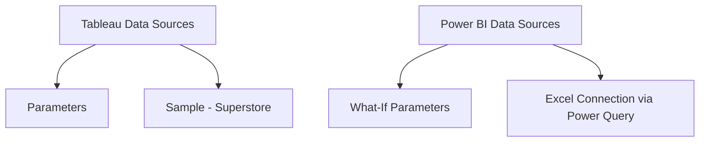

---

### **2.2. Calculated Fields Migration**

**Example Calculated Fields in Tableau:**
1. **Profit Ratio**
   ```xml
   <column caption='Profit Ratio' datatype='real' default-format='p0%' name='[Calculation_5571209093911105]' role='measure' type='quantitative'>
       <calculation class='tableau' formula='SUM([Profit])/SUM([Sales])' scope-isolation='false' />
   </column>
   ```
2. **Number of Records**
   ```xml
   <column datatype='integer' name='[Number of Records]' role='measure' type='quantitative' user:auto-column='numrec'>
       <calculation class='tableau' formula='1' />
   </column>
   ```

**Power BI Equivalent:**

1. **Profit Ratio Measure**
   ```dax
   Profit Ratio = DIVIDE(SUM('Sample - Superstore'[Profit]), SUM('Sample - Superstore'[Sales]), 0)
   ```
   - **Formatting:** Set as **Percentage** with **0 decimal places**.

2. **Number of Records Measure**
   ```dax
   Number of Records = COUNTROWS('Sample - Superstore')
   ```

**Mermaid Diagram: Calculated Fields Migration**
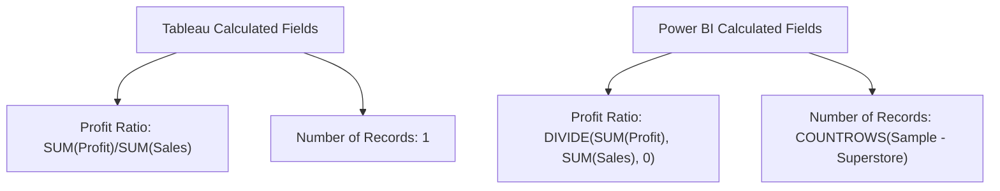

---

### **2.3. Groups and Hierarchies Migration**

**Tableau XML Component:**
```xml
<drill-path name='Location'>
    <field>[Country]</field>
    <field>[State]</field>
    <field>[City]</field>
    <field>[Postal Code]</field>
</drill-path>
<drill-path name='Product'>
    <field>[Category]</field>
    <field>[Sub-Category]</field>
    <field>[Product Name (group)]</field>
    <field>[Product Name]</field>
</drill-path>
```

**Power BI Equivalent:**
- **Hierarchies:** Create **Field Hierarchies** in Power BI for Location and Product dimensions to enable drill-down functionalities.

**Mermaid Diagram: Groups and Hierarchies Migration**
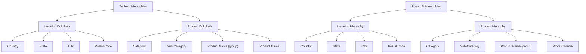

**Steps to Create Hierarchies in Power BI:**

1. **Location Hierarchy:**
   - Go to the **Fields** pane.
   - Right-click on `Country` and select **New hierarchy**. Rename it to `Location Hierarchy`.
   - Drag `State`, `City`, and `Postal Code` into the `Location Hierarchy`.

2. **Product Hierarchy:**
   - Right-click on `Category` and select **New hierarchy**. Rename it to `Product Hierarchy`.
   - Drag `Sub-Category`, `Product Name (group)`, and `Product Name` into the `Product Hierarchy`.

---

### **2.4. Worksheets Migration**

#### **2.4.1. Profit Map Worksheet**

**Tableau Visualization: Profit Map**
- **Type:** Geographic Scatter Plot
- **Fields:**
  - **Rows:** Latitude (generated)
  - **Columns:** Longitude (generated)
  - **Size:** SUM(Profit)
  - **Level of Detail:** Country, State
- **Interactivity:**
  - **Filters:** Top Customers by Profit
  - **Drill-Down:** Location Hierarchy

**Power BI Equivalent:**
- **Visual Type:** **Map** or **Scatter Chart** with **Location** data.
- **Fields Mapping:**
  - **Latitude:** Longitude (generated)
  - **Longitude:** Latitude (generated)
  - **Size:** Total Profit
  - **Tooltips:** Country, State
- **Interactivity:**
  - **Filters:** Apply a Top N filter based on the `Is Top Customer` measure.
  - **Drill-Down:** Utilize the `Location Hierarchy` for interactive exploration.

**Steps to Create in Power BI:**

1. **Insert Map/Satter Chart Visual:**
   - Navigate to the **Report** view.
   - Select the **Map** or **Scatter Chart** visual from the **Visualizations** pane.

2. **Configure Fields:**
   - **For Scatter Chart:**
     - **X Axis:** `Longitude (generated)`
     - **Y Axis:** `Latitude (generated)`
     - **Size:** `Total Profit`
     - **Tooltips:** `Country`, `State`
   - **For Map:**
     - **Location:** Combine `Latitude (generated)` and `Longitude (generated)` or use a single geographic field.
     - **Legend or Size:** `Total Profit`
     - **Tooltips:** `Country`, `State`

3. **Apply Top Customers Filter:**
   - **Create a What-If Parameter** for Top Customers as previously outlined.
   - **Use the `Is Top Customer` Measure** to filter the visual to display only top N customers.

4. **Enable Drill-Down:**
   - Ensure that the `Location Hierarchy` is applied to the visual.
   - Enable **Drill Mode** by clicking the drill-down button in the visual header.

**Mermaid Diagram: Profit Map Migration**
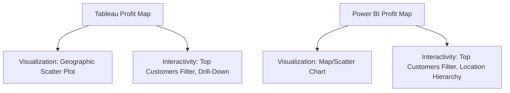

---

#### **2.4.2. Sales by Category Worksheet**

**Tableau Visualization: Sales by Category**
- **Type:** Bar Chart
- **Fields:**
  - **Rows:** Category
  - **Columns:** SUM(Sales)
- **Interactivity:**
  - **Filters:** Top Customers by Profit

**Power BI Equivalent:**
- **Visual Type:** **Bar Chart**
- **Fields Mapping:**
  - **Axis:** Category
  - **Values:** Total Sales
- **Interactivity:**
  - **Filters:** Apply a Top N filter based on the `Is Top Customer` measure.

**Steps to Create in Power BI:**

1. **Insert Bar Chart Visual:**
   - In the **Report** view, select the **Clustered Bar Chart** from the **Visualizations** pane.

2. **Configure Fields:**
   - **Y Axis:** `Category`
   - **X Axis:** `Total Sales`
   - **Tooltips:** Add any additional fields if necessary (e.g., `Sub-Category`).

3. **Apply Top Customers Filter:**
   - Use the `Is Top Customer` measure in the **Filters on this visual** pane.
   - Set the filter to show items where `Is Top Customer` is **1**.

4. **Formatting:**
   - **Title:** Rename to "Sales by Category".
   - **Data Labels:** Enable for clarity.
   - **Colors:** Adjust to match branding or preferred aesthetics.

**Mermaid Diagram: Sales by Category Migration**
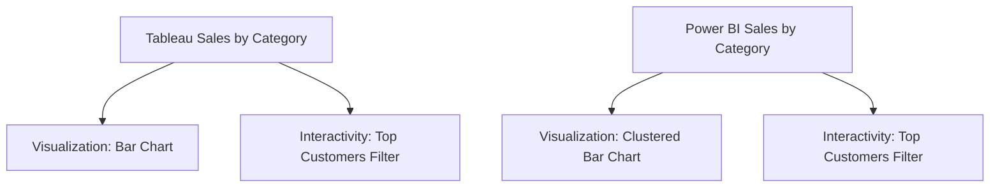

---

### **2.5. Layout and Styling Migration**

**Tableau Layout Configuration:**
```xml
<layout dim-ordering='alphabetic' dim-percentage='0.557522' group-percentage='0.0634218' measure-ordering='alphabetic' measure-percentage='0.240413' show-structure='false' />
```

**Power BI Equivalent:**
- **Layout:** Arrange visuals in Power BI's **Report Canvas** to mirror Tableau's layout proportions.
- **Styling:** Use Power BI's **Theme** feature to apply consistent color schemes and fonts.

**Mermaid Diagram: Layout and Styling Migration**
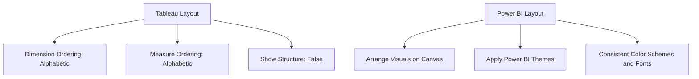

---

### **2.6. Aliases Migration**

**Tableau XML Component:**
```xml
<aliases enabled='yes'>
    <alias key='&quot;While you Were Out&quot; Message Book, One Form per Page' value='Other' />
    <alias key='&quot;3D Systems Cube Printer, 2nd Generation, Magenta&quot;' value='3D Systems' />
    <!-- Additional aliases -->
</aliases>
```

**Power BI Equivalent:**
- **Aliases:** Create a **Mapping Table** to replace complex or lengthy product names with simplified aliases using **DAX**.

**Steps to Create Aliases in Power BI:**

1. **Create a Mapping Table:**
   - Go to the **Modeling** tab and select **New Table**.
   - Enter the following DAX formula:
     ```dax
     Product Aliases = DATATABLE(
         "Original Product Name", STRING,
         "Alias", STRING,
         {
             {"\"While you Were Out\" Message Book, One Form per Page", "Other"},
             {"3D Systems Cube Printer, 2nd Generation, Magenta", "3D Systems"}
             // Add additional aliases here
         }
     )
     ```
  
2. **Create a Calculated Column for Aliased Names:**
   - In the `'Sample - Superstore'` table, create a **New Column**:
     ```dax
     Product Alias =
     COALESCE(
         LOOKUPVALUE(
             'Product Aliases'[Alias],
             'Product Aliases'[Original Product Name],
             'Sample - Superstore'[Product Name]
         ),
         'Sample - Superstore'[Product Name]
     )
     ```
  
3. **Use Aliased Names in Visuals:**
   - Replace the original `Product Name` field with `Product Alias` in your visuals to display simplified names.

**Mermaid Diagram: Aliases Migration**
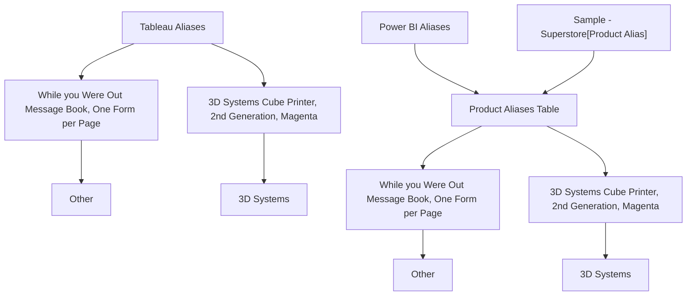

---

### **2.7. Interactivity and User Controls Migration**

**Tableau Interactivity Components:**
- **Parameters:** Allow users to adjust values dynamically (e.g., Top Customers, Profit Bin Size).
- **Filters:** Enable filtering based on calculated groups (e.g., Top Customers by Profit).
- **Drill-Down Hierarchies:** Allow users to explore data hierarchically (e.g., Location Hierarchy).

**Power BI Equivalent:**
- **What-If Parameters:** Replicate Tableau's Parameters using Power BI’s **What-If Parameters**.
- **Visual Filters:** Apply DAX measures to filter visuals dynamically.
- **Hierarchies:** Enable **Drill-Down** using created hierarchies.

**Mermaid Diagram: Interactivity Migration**
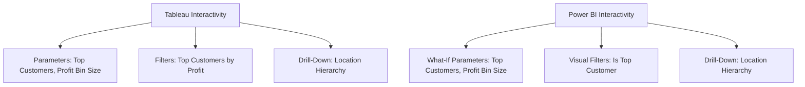

**Steps to Implement Interactivity in Power BI:**

1. **Create What-If Parameters:**
   - **Top Customers:**
     - **Name:** Top Customers
     - **Values:** 5, 10, 15, 20
   - **Profit Bin Size:**
     - **Name:** Profit Bin Size
     - **Values:** 50, 100, 150, 200

2. **Create DAX Measures for Filtering:**
   - As outlined in **2.4.3. Top Customers by Profit**, create measures `Customer Profit Rank` and `Is Top Customer`.

3. **Apply Filters to Visuals:**
   - Use the `Is Top Customer` measure in the **Filters pane** for each visual to display only the top N customers.

4. **Enable Drill-Down in Hierarchies:**
   - Ensure that hierarchies like `Location Hierarchy` are applied to visuals like the Profit Map.
   - Enable **Drill Mode** by clicking the drill-down button in the visual header.

---

## **3. Example Migration Workflow for "Profit Map" Worksheet**

To provide a **practical example**, here's a step-by-step workflow to migrate the "Profit Map" Tableau worksheet to Power BI.

### **3.1. Importing Data into Power BI**

1. **Open Power BI Desktop.**
2. **Get Data:**
   - Click on **Home** > **Get Data** > **Excel**.
3. **Select Tableau Data Source:**
   - Navigate to `/Users/chris.toomey/Documents/My Tableau Repository/Datasources/9.0/en_US-US/Sample - Superstore.xls`.
4. **Load Relevant Sheets:**
   - Select the `Orders$` sheet and click **Load**.

### **3.2. Creating Calculated Measures**

1. **Profit Ratio:**
   ```dax
   Profit Ratio = DIVIDE(SUM('Sample - Superstore'[Profit]), SUM('Sample - Superstore'[Sales]), 0)
   ```
   - **Format:** Percentage, 0 decimal places.

2. **Number of Records:**
   ```dax
   Number of Records = COUNTROWS('Sample - Superstore')
   ```

3. **Top Customers Measures:**
   - **Top Customers Selected:**
     ```dax
     Top Customers Selected = SELECTEDVALUE('Top Customers Value'[Top Customers Value], 5)
     ```
   - **Customer Profit Rank:**
     ```dax
     Customer Profit Rank =
     RANKX(
         ALL('Sample - Superstore'[Customer Name]),
         SUM('Sample - Superstore'[Profit]),
         ,
         DESC,
         Dense
     )
     ```
   - **Is Top Customer:**
     ```dax
     Is Top Customer =
     IF(
         [Customer Profit Rank] <= [Top Customers Selected],
         1,
         0
     )
     ```

4. **Profit Bin Measures:**
   - **Profit Bin Size Selected:**
     ```dax
     Profit Bin Size Selected = SELECTEDVALUE('Profit Bin Size Value'[Profit Bin Size Value], 200)
     ```
   - **Profit Bin:**
     ```dax
     Profit Bin =
     FLOOR(SUM('Sample - Superstore'[Profit]), [Profit Bin Size Selected])
     ```

### **3.3. Creating Hierarchies**

1. **Location Hierarchy:**
   - Right-click on `Country` > **New hierarchy** > Rename to `Location Hierarchy`.
   - Drag `State`, `City`, and `Postal Code` into `Location Hierarchy`.

2. **Product Hierarchy:**
   - Right-click on `Category` > **New hierarchy** > Rename to `Product Hierarchy`.
   - Drag `Sub-Category`, `Product Name (group)`, and `Product Name` into `Product Hierarchy`.

### **3.4. Setting Up Visualizations**

#### **3.4.1. Profit Map Visualization**

1. **Insert Scatter Chart:**
   - Select the **Scatter Chart** from the **Visualizations** pane.

2. **Configure Fields:**
   - **X Axis:** `Longitude (generated)`
   - **Y Axis:** `Latitude (generated)`
   - **Size:** `Total Profit`
   - **Tooltips:** `Country`, `State`

3. **Apply Top Customers Filter:**
   - Drag `Is Top Customer` measure to the **Filters on this visual** pane.
   - Set to **1** to display only top N customers.

4. **Enable Drill-Down:**
   - Ensure `Location Hierarchy` is applied to the visual.
   - Click the **Drill Mode** button to enable interactive exploration.

5. **Formatting:**
   - **Title:** Rename to "Profit Map".
   - **Data Colors:** Customize as needed.
   - **Data Labels:** Enable for better visibility.

**Mermaid Diagram: Profit Map Visualization Setup**
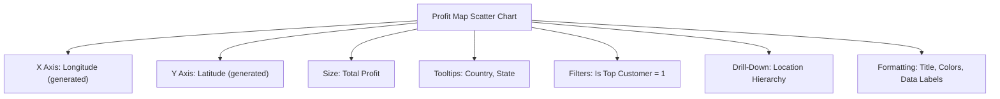

---

#### **3.4.2. Sales by Category Visualization**

1. **Insert Bar Chart:**
   - Select the **Clustered Bar Chart** from the **Visualizations** pane.

2. **Configure Fields:**
   - **Y Axis:** `Category`
   - **X Axis:** `Sum of Sales`
   - **Tooltips:** Add `Sub-Category` if desired.

3. **Apply Top Customers Filter:**
   - Drag `Is Top Customer` measure to the **Filters on this visual** pane.
   - Set to **1** to display only top N customers.

4. **Formatting:**
   - **Title:** Rename to "Sales by Category".
   - **Data Labels:** Enable for clarity.
   - **Colors:** Adjust to match branding or preferred aesthetics.

**Mermaid Diagram: Sales by Category Visualization Setup**
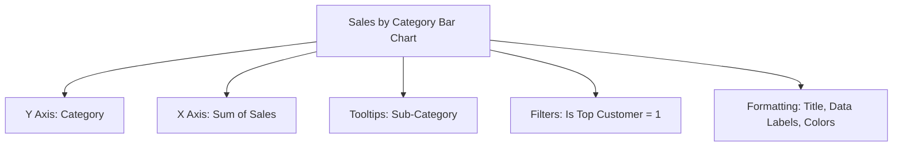

---

### **3.5. Applying Aliases in Power BI**

**Example Alias Mapping:**
- **Original:** `"While you Were Out" Message Book, One Form per Page`
- **Alias:** `Other`
- **Original:** `"3D Systems Cube Printer, 2nd Generation, Magenta"`
- **Alias:** `3D Systems`

**Steps to Implement Aliases:**

1. **Create a Mapping Table:**
   - **Modeling** > **New Table**
   - Enter the following DAX formula:
     ```dax
     Product Aliases = DATATABLE(
         "Original Product Name", STRING,
         "Alias", STRING,
         {
             {"\"While you Were Out\" Message Book, One Form per Page", "Other"},
             {"3D Systems Cube Printer, 2nd Generation, Magenta", "3D Systems"}
             // Add additional aliases as needed
         }
     )
     ```

2. **Create a Calculated Column for Aliased Product Names:**
   - In the `'Sample - Superstore'` table, create a **New Column**:
     ```dax
     Product Alias =
     COALESCE(
         LOOKUPVALUE(
             'Product Aliases'[Alias],
             'Product Aliases'[Original Product Name],
             'Sample - Superstore'[Product Name]
         ),
         'Sample - Superstore'[Product Name]
     )
     ```

3. **Use Aliased Names in Visuals:**
   - Replace `Product Name` with `Product Alias` in your visuals to display simplified names.

**Mermaid Diagram: Aliases Implementation**
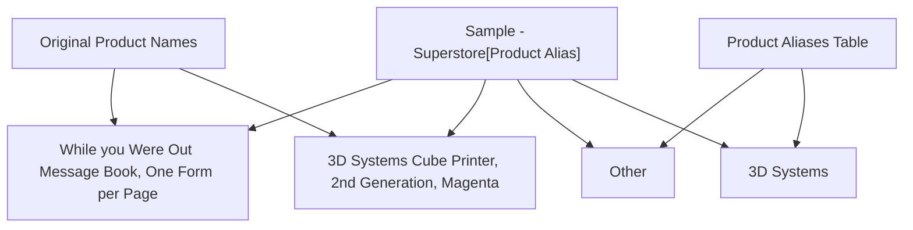

---

### **3.6. Ensuring Consistent Layout and Styling**

**Tableau Layout Configuration:**
```xml
<layout dim-ordering='alphabetic' dim-percentage='0.557522' group-percentage='0.0634218' measure-ordering='alphabetic' measure-percentage='0.240413' show-structure='false' />
```

**Power BI Equivalent:**
- **Report Layout:** Use Power BI’s **Gridlines** and **Snap to Grid** features to align visuals consistently.
- **Styling:** Apply a **Power BI Theme** to maintain consistent color schemes and fonts across visuals.

**Mermaid Diagram: Layout and Styling Consistency**
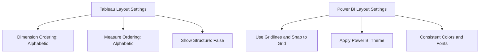

---

## **4. Summary of Migration Approaches**

| **Tableau Component**          | **Tableau Feature**               | **Power BI Equivalent**                          | **Migration Approach**                                      |
|--------------------------------|-----------------------------------|-------------------------------------------------|-------------------------------------------------------------|
| **Data Sources**               | Parameters, Excel Connection      | What-If Parameters, Power Query (M) Connection  | Recreate parameters using What-If; connect via Power Query   |
| **Calculated Fields**          | Profit Ratio, Number of Records   | DAX Measures: Profit Ratio, Number of Records    | Convert Tableau formulas to equivalent DAX measures          |
| **Groups and Hierarchies**     | Location, Product Hierarchies      | Field Hierarchies in Power BI                    | Create hierarchies for drill-down functionality             |
| **Visualizations**             | Profit Map (Geographic Scatter Plot), Sales by Category (Bar Chart) | Map/Scatter Chart, Clustered Bar Chart | Use corresponding Power BI visuals and configure fields accordingly |
| **Layout and Styling**         | Dimension and Measure Ordering    | Gridlines, Snap to Grid, Power BI Themes         | Arrange visuals using grid settings; apply consistent themes  |
| **Aliases**                    | Simplified Field Names             | Mapping Tables with DAX Measures                 | Create mapping tables and calculated columns for aliases     |
| **Interactivity**              | Top N Filters, Drill-Down          | What-If Parameters, DAX Filtering, Hierarchies   | Implement interactivity using What-If Parameters and DAX    |

---

## **5. Best Practices for Migration**

1. **Validate Data Integrity:** Ensure that all data transformations and calculations in Power BI match the original Tableau outputs.
2. **Optimize Performance:** Utilize efficient DAX formulas and Power BI’s performance optimization features to match or exceed Tableau’s performance.
3. **Consistent Styling:** Maintain a consistent look and feel by applying themes and standardized formatting across all visuals.
4. **Leverage Power BI Features:** Take advantage of Power BI’s unique features like rich interactivity, tooltips, and advanced visual types to enhance the migrated report.

---

## **6. Additional Recommendations**

- **Use Power BI Templates:** Create a Power BI template (`.pbit`) with predefined themes, hierarchies, and measures to streamline the migration of similar reports.
- **Automate Repetitive Tasks:** Utilize Power BI’s **Power Query** scripting and **DAX** measures to automate data transformations and calculations.
- **Engage Stakeholders:** Collaborate with report users to ensure that the migrated Power BI report meets their needs and expectations, making adjustments as necessary.

---

## **Conclusion**

Migrating Tableau report visualizations and dashboards to Power BI involves thoughtfully mapping each component—data connections, calculated fields, groupings, hierarchies, visual types, and interactivity features—to Power BI's equivalent functionalities. By following the specific approaches outlined above and leveraging Power BI’s robust toolset, you can ensure a seamless transition that maintains the integrity, performance, and user experience of the original Tableau reports.

Feel free to reach out if you need further assistance with specific components or encounter challenges during the migration process!