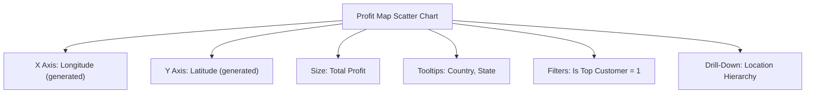
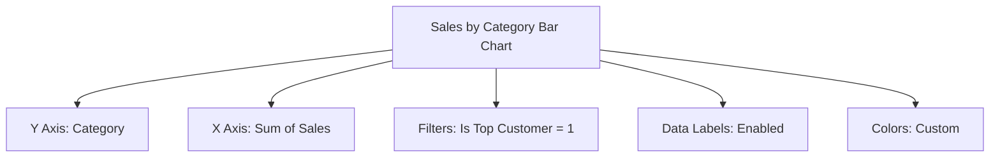

# Prompt:

This is a XML file corresponding to a Tableau report. Can you convert the formulas in this XML file into equivalent Power BI DAX constructs?

# Response

Certainly! Converting Tableau formulas from an XML workbook to Power BI's DAX (Data Analysis Expressions) involves understanding the purpose of each formula and then translating it into equivalent DAX constructs. Below, I'll outline the key formulas found in your provided Tableau XML file and provide their corresponding DAX equivalents for Power BI.

### 1. **Parameters**

**Tableau Parameters:**
- **[Parameter 1]**:
  - **Name**: Top Customers
  - **Datatype**: Integer
  - **Default Value**: 5
  - **Range**: 5 to 20
  - **Granularity**: 5

- **[Parameter 2]**:
  - **Name**: Profit Bin Size
  - **Datatype**: Integer
  - **Default Value**: 200
  - **Range**: 50 to 200
  - **Granularity**: 50

**Power BI Equivalent: "What-if" Parameters**

Power BI’s "What-if" parameters allow users to interactively change values that affect calculations and visuals.

**Steps to Create What-if Parameters:**

1. **Top Customers Parameter ([Parameter 1])**

   - **Name**: `Top Customers`
   - **Data Type**: Whole Number
   - **Minimum**: 5
   - **Maximum**: 20
   - **Increment**: 5
   - **Default Value**: 5

   This will create a table named `Top Customers` with a column `[Top Customers Value]`.

2. **Profit Bin Size Parameter ([Parameter 2])**

   - **Name**: `Profit Bin Size`
   - **Data Type**: Whole Number
   - **Minimum**: 50
   - **Maximum**: 200
   - **Increment**: 50
   - **Default Value**: 200

   This will create a table named `Profit Bin Size` with a column `[Profit Bin Size Value]`.

### 2. **Calculated Measures**

#### a. **Profit Ratio**

**Tableau Formula:**
```xml
<calculation class='tableau' formula='SUM([Profit])/SUM([Sales])' />
```

**Power BI DAX Equivalent:**

```DAX
Profit Ratio = DIVIDE(SUM(Sales[Profit]), SUM(Sales[Sales]), 0)
```

**Explanation:**
- `DIVIDE` is used instead of the `/` operator to safely handle division by zero by providing a default value (`0` in this case).
- Replace `Sales` with your actual table name if different.

#### b. **Profit (Bin)**

**Tableau Calculation:**
```xml
<calculation class='bin' decimals='0' formula='[Profit]' peg='0' size-parameter='[Parameters].[Parameter 2]' />
```

**Power BI DAX Equivalent:**

1. **Create a Calculated Column for Binning:**

   ```DAX
   Profit Bin =
   FLOOR(
       Sales[Profit],
       SELECTEDVALUE('Profit Bin Size'[Profit Bin Size Value], 200)
   )
   ```

   **Explanation:**
   - `FLOOR` rounds down the `[Profit]` value to the nearest multiple of `[Profit Bin Size Value]`.
   - `SELECTEDVALUE` fetches the current value of the `Profit Bin Size` parameter. If no value is selected, it defaults to `200`.

2. **Alternatively, Using a Calculated Column with Variables:**

   ```DAX
   Profit Bin =
   VAR BinSize = SELECTEDVALUE('Profit Bin Size'[Profit Bin Size Value], 200)
   RETURN
       FLOOR(Sales[Profit], BinSize)
   ```

### 3. **Top Customers by Profit Set**

**Tableau Set Definition:**
```xml
<group name='[Top Customers by Profit]' ...>
    <groupfilter count='[Parameters].[Parameter 1]' end='top' function='end' units='records' ...>
        <groupfilter direction='DESC' expression='SUM([Profit])' function='order' ...>
            <groupfilter function='level-members' level='[Customer Name]' ... />
        </groupfilter>
    </groupfilter>
</group>
```

**Power BI DAX Equivalent:**

1. **Create a Measure to Rank Customers:**

   ```DAX
   Customer Rank =
   RANKX(
       ALL(Sales[Customer Name]),
       CALCULATE(SUM(Sales[Profit])),
       ,
       DESC,
       DENSE
   )
   ```

   **Explanation:**
   - `RANKX` assigns a rank to each customer based on the total `[Profit]`.
   - `ALL(Sales[Customer Name])` removes any existing filters on `[Customer Name]` to rank all customers.
   - `DESC` sorts the rank in descending order (highest profit gets rank 1).
   - `DENSE` ranking ensures no gaps in ranks.

2. **Create a Measure to Identify Top N Customers:**

   ```DAX
   Is Top Customer =
   VAR TopN = SELECTEDVALUE('Top Customers'[Top Customers Value], 5)
   VAR CurrentRank = [Customer Rank]
   RETURN
       IF(CurrentRank <= TopN, 1, 0)
   ```

   **Explanation:**
   - This measure returns `1` if the customer is within the top N based on `[Customer Rank]`, else `0`.
   - Replace `'Top Customers'[Top Customers Value]` with the actual column name created by the "What-if" parameter.

3. **Apply the Measure as a Filter:**

   In your visual (e.g., a table or chart showing customers), drag the `Is Top Customer` measure to the Filters pane and set it to `1`. This will display only the top N customers based on the selected parameter.

### 4. **Number of Records**

**Tableau Calculation:**
```xml
<column datatype='integer' name='[Number of Records]' role='measure' type='quantitative'>
    <calculation class='tableau' formula='1' />
</column>
```

**Power BI DAX Equivalent:**

**Option 1: Calculated Column**

```DAX
Number of Records = 1
```

**Option 2: Using COUNTROWS as a Measure**

If you need to count the number of records dynamically:

```DAX
Number of Records = COUNTROWS(Sales)
```

**Explanation:**
- `COUNTROWS(Sales)` counts the number of rows in the `Sales` table.
- Use the calculated column `Number of Records` if you need a static value per row.

### 5. **Additional Considerations**

#### a. **Hierarchies and Drill-Downs**

Tableau hierarchies like `Location` and `Product` can be replicated in Power BI by creating hierarchies in the Fields pane.

**Example:**

1. **Location Hierarchy:**
   - Drag `[Country]`, `[State]`, `[City]`, `[Postal Code]` into a new hierarchy named `Location`.

2. **Product Hierarchy:**
   - Drag `[Category]`, `[Sub-Category]`, `[Product Name (group)]`, `[Product Name]` into a new hierarchy named `Product`.

#### b. **Calculated Columns and Additional Measures**

If there are other calculated fields or measures in Tableau, replicate them similarly in Power BI by understanding their logic and translating them into DAX.

### 6. **Summary of DAX Formulas**

Here's a consolidated view of the DAX formulas based on the Tableau XML:

```DAX
-- 1. Parameters are created using Power BI's What-if feature.

-- 2. Calculated Measures
Profit Ratio = DIVIDE(SUM(Sales[Profit]), SUM(Sales[Sales]), 0)

-- 3. Binned Profit
Profit Bin =
FLOOR(
    Sales[Profit],
    SELECTEDVALUE('Profit Bin Size'[Profit Bin Size Value], 200)
)

-- 4. Customer Ranking and Top N Identification
Customer Rank =
RANKX(
    ALL(Sales[Customer Name]),
    CALCULATE(SUM(Sales[Profit])),
    ,
    DESC,
    DENSE
)

Is Top Customer =
VAR TopN = SELECTEDVALUE('Top Customers'[Top Customers Value], 5)
VAR CurrentRank = [Customer Rank]
RETURN
    IF(CurrentRank <= TopN, 1, 0)

-- 5. Number of Records
Number of Records = COUNTROWS(Sales)

-- 6. (Optional) Additional Calculated Columns or Measures as needed
```

### 7. **Implementing Filters and Visuals**

- **Top Customers Filter:** Use the `Is Top Customer` measure to filter visuals to show only top N customers.
- **Profit Bin:** Utilize the `Profit Bin` calculated column for grouping profits into bins based on the selected parameter.
- **Parameters:** Add slicers for `Top Customers` and `Profit Bin Size` to allow dynamic interaction.

### 8. **Handling Advanced Calculations**

If your Tableau workbook contains more complex calculations, hierarchies, or custom aggregations, you can replicate them in Power BI by:

- **Creating Additional Measures:** Use DAX to perform similar aggregations.
- **Setting Up Hierarchies:** Organize fields into hierarchies for drill-down capabilities.
- **Using Calculated Columns:** For row-level calculations that depend on other columns.

### 9. **Final Steps**

1. **Set Up Parameters:** Create "What-if" parameters in Power BI as outlined.
2. **Create Calculated Columns and Measures:** Implement the DAX formulas.
3. **Build Hierarchies:** Organize your data fields into meaningful hierarchies.
4. **Design Visuals:** Replicate Tableau worksheets using Power BI visuals, applying the necessary measures and filters.
5. **Test Interactivity:** Ensure that parameter slicers correctly influence visuals and calculations.

By following these steps, you can effectively translate the key formulas from your Tableau XML workbook into Power BI's DAX, leveraging Power BI's interactive capabilities for dynamic reporting.

If you have additional specific formulas or more complex calculations within the XML that you'd like to convert, feel free to provide them, and I can assist further!

# Prompt:

As mentioned earlier, attached is the XML file corresponding to a Tableau report. Can you convert the formulas and calculated fields in this XML file into equivalent Power BI DAX constructs?

---
---

# Response:

Certainly! Below is a detailed conversion of the formulas and calculated fields from your provided Tableau XML file into equivalent Power BI DAX constructs. This guide includes explanations and corresponding DAX code snippets to facilitate a smooth migration to Power BI.

---

## **1. Overview of Calculated Fields in Tableau XML**

The Tableau XML file defines several calculated fields within the `datasources` section. Below are the key calculated fields identified:

1. **Profit Ratio**
2. **Number of Records**
3. **Profit (bin)**
4. **Additional Calculated Fields**

---

## **2. Detailed Conversion of Calculated Fields**

### **2.1. Profit Ratio**

#### **Tableau Definition:**
```xml
<column caption='Profit Ratio' datatype='real' default-format='p0%' name='[Calculation_5571209093911105]' role='measure' type='quantitative'>
    <calculation class='tableau' formula='SUM([Profit])/SUM([Sales])' scope-isolation='false' />
</column>
```

#### **Power BI Equivalent:**

**DAX Measure: Profit Ratio**

```dax
Profit Ratio = DIVIDE(SUM('Sample - Superstore'[Profit]), SUM('Sample - Superstore'[Sales]), 0)
```

**Steps to Create in Power BI:**

1. **Open Power BI Desktop.**
2. **Navigate to the Modeling Tab:**
   - Click on **Modeling** > **New Measure**.
3. **Enter the DAX Formula:**
   - Paste the above DAX code.
4. **Format the Measure:**
   - Select the `Profit Ratio` measure.
   - In the **Modeling** tab, set the **Data Type** to **Decimal Number**.
   - Set **Format** to **Percentage** and **Decimal Places** to **0**.

**Explanation:**
- The `DIVIDE` function is used to safely handle division, avoiding errors when the denominator is zero.
- Formatting as a percentage aligns with the Tableau `p0%` format.

---

### **2.2. Number of Records**

#### **Tableau Definition:**
```xml
<column datatype='integer' name='[Number of Records]' role='measure' type='quantitative' user:auto-column='numrec'>
    <calculation class='tableau' formula='1' />
</column>
```

#### **Power BI Equivalent:**

**DAX Measure: Number of Records**

```dax
Number of Records = COUNTROWS('Sample - Superstore')
```

**Alternative: Calculated Column (Less Efficient)**

```dax
Number of Records = 1
```

**Steps to Create in Power BI:**

1. **Open Power BI Desktop.**
2. **Navigate to the Modeling Tab:**
   - Click on **Modeling** > **New Measure**.
3. **Enter the DAX Formula:**
   - Paste the first DAX measure provided above.
4. **Press Enter** to create the measure.

**Explanation:**
- Using `COUNTROWS` is more efficient as it dynamically counts the number of rows in the table.
- A calculated column with a constant value is less efficient and generally not recommended for counting purposes.

---

### **2.3. Profit (bin)**

#### **Tableau Definition:**
```xml
<column caption='Profit (bin)' datatype='integer' name='[Profit (bin)]' role='dimension' type='ordinal'>
    <calculation class='bin' decimals='0' formula='[Profit]' peg='0' size-parameter='[Parameters].[Parameter 2]' />
</column>
```

#### **Power BI Equivalent:**

To replicate the binning functionality based on `[Parameter 2]`, we'll use **What-If Parameters** and DAX measures.

#### **Steps to Convert:**

1. **Create a What-If Parameter for Bin Size:**

   - **Navigate to the Modeling Tab:**
     - Click on **Modeling** > **New Parameter** > **What If Parameter**.
  
   - **Configure the Parameter:**
     - **Name:** `Profit Bin Size`
     - **Data Type:** Whole Number
     - **Minimum:** 50
     - **Maximum:** 200
     - **Increment:** 50
     - **Default:** 200
     - **Add slicer to this page:** Checked
  
   - **Result:**
     - A new table `Profit Bin Size Value` is created with values: 50, 100, 150, 200.
     - A slicer visual is added to the report page for dynamic bin size selection.

2. **Create a DAX Measure for Binned Profit:**

   ```dax
   Profit Bin =
   VAR BinSize = SELECTEDVALUE('Profit Bin Size Value'[Profit Bin Size Value], 200)
   RETURN FLOOR(SUM('Sample - Superstore'[Profit]), BinSize)
   ```

3. **Implement the Binning in Visuals:**

   - **Insert a Visual:** For example, a **Table** visual.
   - **Add Fields:**
     - **Category**, **Sum of Profit**, and **Profit Bin**.
   - **Explanation:**
     - The `FLOOR` function rounds down the `Sum of Profit` to the nearest multiple of the selected bin size.

---

### **2.4. Top Customers by Profit**

#### **Tableau Definition:**
```xml
<group name='[Top Customers by Profit]' name-style='unqualified' user:ui-builder='filter-group'>
    <groupfilter count='[Parameters].[Parameter 1]' end='top' function='end' units='records' user:ui-marker='end' user:ui-top-by-field='true'>
        <groupfilter direction='DESC' expression='SUM([Profit])' function='order' user:ui-marker='order'>
            <groupfilter function='level-members' level='[Customer Name]' user:ui-enumeration='all' user:ui-marker='enumerate' />
        </groupfilter>
    </groupfilter>
</group>
```

#### **Power BI Equivalent:**

To implement a dynamic Top N filter based on a parameter, follow these steps:

1. **Create a What-If Parameter for Top Customers:**

   - **Name:** `Top Customers`
   - **Data Type:** Whole Number
   - **Minimum:** 5
   - **Maximum:** 20
   - **Increment:** 5
   - **Default:** 5
   - **Add slicer to this page:** Checked
  
   - **Result:**
     - A table `Top Customers Value` is created with values: 5, 10, 15, 20.
     - A slicer visual is added to the report page for dynamic selection.

2. **Create a DAX Measure to Rank Customers by Profit:**

   ```dax
   Customer Profit Rank =
   RANKX(
       ALL('Sample - Superstore'[Customer Name]),
       SUM('Sample - Superstore'[Profit]),
       ,
       DESC,
       Dense
   )
   ```

3. **Create a DAX Measure to Flag Top Customers:**

   ```dax
   Is Top Customer =
   IF(
       [Customer Profit Rank] <= SELECTEDVALUE('Top Customers Value'[Top Customers Value], 5),
       1,
       0
   )
   ```

4. **Apply the Top Customers Filter in Visuals:**

   - **Select the Visual:** For instance, a **Table** or **Chart** visual listing customers.
   - **Add Fields:**
     - **Customer Name**, **Sum of Profit**, etc.
   - **Apply Filter:**
     - Drag the `Is Top Customer` measure to the **Filters** pane for the visual.
     - Set the filter condition to show items where `Is Top Customer` is **1**.

**Explanation:**
- The `RANKX` function ranks customers based on the sum of profit in descending order.
- The `Is Top Customer` measure flags customers whose rank is within the selected Top N.

---

### **2.5. Example Power BI Implementation Workflow**

Below is a consolidated workflow to implement the converted calculated fields and measures in Power BI.

#### **Step 1: Import Data**

1. **Open Power BI Desktop.**
2. **Get Data:** Click on **Home** > **Get Data** > **Excel**.
3. **Select File:** Locate and select `/Users/chris.toomey/Documents/My Tableau Repository/Datasources/9.0/en_US-US/Sample - Superstore.xls`.
4. **Load Data:** Select the relevant sheets (e.g., `Orders$`) and click **Load**.

#### **Step 2: Create DAX Measures and Parameters**

1. **Profit Ratio:**
   - **Create Measure:**
     ```dax
     Profit Ratio = DIVIDE(SUM('Sample - Superstore'[Profit]), SUM('Sample - Superstore'[Sales]), 0)
     ```
   - **Format as Percentage:** 0 decimal places.

2. **Number of Records:**
   - **Create Measure:**
     ```dax
     Number of Records = COUNTROWS('Sample - Superstore')
     ```

3. **Top Customers Parameter:**
   - **Create What-If Parameter:**
     - **Name:** `Top Customers`
     - **Values:** 5, 10, 15, 20
   - **Create Measures:**
     ```dax
     Top Customers Selected = SELECTEDVALUE('Top Customers Value'[Top Customers Value], 5)
    
     Customer Profit Rank =
     RANKX(
         ALL('Sample - Superstore'[Customer Name]),
         SUM('Sample - Superstore'[Profit]),
         ,
         DESC,
         Dense
     )
    
     Is Top Customer =
     IF(
         [Customer Profit Rank] <= [Top Customers Selected],
         1,
         0
     )
     ```

4. **Profit Bin Size Parameter:**
   - **Create What-If Parameter:**
     - **Name:** `Profit Bin Size`
     - **Values:** 50, 100, 150, 200
   - **Create Measures:**
     ```dax
     Profit Bin Size Selected = SELECTEDVALUE('Profit Bin Size Value'[Profit Bin Size Value], 200)
    
     Profit Bin =
     FLOOR(SUM('Sample - Superstore'[Profit]), [Profit Bin Size Selected])
     ```

#### **Step 3: Create Hierarchies**

1. **Location Hierarchy:**
   - **Right-click on `Country` column** > **New hierarchy** > **Rename to `Location Hierarchy`**.
   - **Drag `State`, `City`,** and **`Postal Code`** into the `Location Hierarchy`.

2. **Product Hierarchy:**
   - **Right-click on `Category` column** > **New hierarchy** > **Rename to `Product Hierarchy`**.
   - **Drag `Sub-Category`, `Product Name (group)`,** and **`Product Name`** into the `Product Hierarchy`.

---

### **2.6. Applying Measures and Filters in Visuals**

#### **a. Profit Map Visualization**

1. **Insert a Scatter Chart:**
   - Navigate to the **Report** view.
   - Select the **Scatter Chart** visual from the **Visualizations** pane.

2. **Configure the Scatter Chart:**
   - **X Axis:** Drag `Longitude (generated)` to the **X Axis**.
   - **Y Axis:** Drag `Latitude (generated)` to the **Y Axis**.
   - **Size:** Drag `Total Profit` measure to the **Size** field.
   - **Tooltips:** Drag `Country` and `State` to the **Tooltips** field.

3. **Apply Top Customers Filter:**
   - **Select the Scatter Chart**.
   - **Drag the `Is Top Customer` measure** to the **Filters** pane for the visual.
   - **Set the filter to show items where `Is Top Customer` is `1`**.

4. **Enable Drill-Down:**
   - Click on the **Drill mode** button (a downward arrow icon) in the top-right corner of the Scatter Chart visual.
   - **Optional:** Use hierarchies to allow drilling down from `Country` to `State`, etc.

#### **b. Sales by Category Visualization**

1. **Insert a Bar Chart:**
   - Select the **Bar Chart** visual from the **Visualizations** pane.

2. **Configure the Bar Chart:**
   - **Axis (Y Axis):** Drag `Category` into the **Axis** field.
   - **Values (X Axis):** Drag `Sum of Sales` measure into the **Values** field.

3. **Apply Top Customers Filter:**
   - **Select the Bar Chart**.
   - **Drag the `Is Top Customer` measure** to the **Filters** pane for the visual.
   - **Set the filter to show items where `Is Top Customer` is `1`**.

4. **Formatting:**
   - **Title:** Rename the chart to "Sales by Category".
   - **Data Labels:** Enable data labels for clarity.
   - **Colors:** Adjust colors to match Tableau aesthetics.

---

## **3. Summary of DAX Conversions**

| **Tableau Calculated Field** | **Tableau Formula**                       | **Power BI DAX Construct**                                                                    | **Type** | **Notes**                                                    |
|------------------------------|-------------------------------------------|---------------------------------------------------------------------------------------------|----------|--------------------------------------------------------------|
| Profit Ratio                 | `SUM([Profit])/SUM([Sales])`              | `Profit Ratio = DIVIDE(SUM('Sample - Superstore'[Profit]), SUM('Sample - Superstore'[Sales]), 0)` | Measure  | Format as Percentage with 0 decimal places                  |
| Number of Records            | `1`                                       | `Number of Records = COUNTROWS('Sample - Superstore')`                                     | Measure  | More efficient as a measure than a calculated column        |
| Profit (bin)                 | Binning based on `[Parameter 2]`          |                                                                                                                                                                 |
|                              |                                           | **What-If Parameter: `Profit Bin Size`                                                       |          | Defines the bin size dynamically                             |
|                              |                                           | `Profit Bin Size Selected = SELECTEDVALUE('Profit Bin Size Value'[Profit Bin Size Value], 200)` | Measure  | Retrieves selected bin size                                   |
|                              |                                           | `Profit Bin = FLOOR(SUM('Sample - Superstore'[Profit]), [Profit Bin Size Selected])`         | Measure  | Bins the total profit based on selected bin size             |
| Top Customers by Profit      | Top N based on `SUM([Profit])`            |                                                                                                                                                                 |
|                              |                                           | **What-If Parameter: `Top Customers`                                                         |          | Defines the number of top customers dynamically               |
|                              |                                           | `Top Customers Selected = SELECTEDVALUE('Top Customers Value'[Top Customers Value], 5)`       | Measure  | Retrieves the selected number of top customers               |
|                              |                                           | `Customer Profit Rank = RANKX(ALL('Sample - Superstore'[Customer Name]), SUM('Sample - Superstore'[Profit]),, DESC, Dense)` | Measure  | Ranks customers based on total profit                        |
|                              |                                           | `Is Top Customer = IF([Customer Profit Rank] <= [Top Customers Selected], 1, 0)`             | Measure  | Flags top N customers for filtering                          |

---

## **4. Implementing Parameters and Dynamic Binning**

### **4.1. Profit Bin Size: What-If Parameter**

- **Configuration:**
  - **Name:** `Profit Bin Size`
  - **Data Type:** Whole Number
  - **Values:** 50, 100, 150, 200
  - **Default:** 200
  - **Automatic Slicer:** Yes

- **DAX Measures:**
  ```dax
  Profit Bin Size Selected = SELECTEDVALUE('Profit Bin Size Value'[Profit Bin Size Value], 200)
 
  Profit Bin =
  FLOOR(SUM('Sample - Superstore'[Profit]), [Profit Bin Size Selected])
  ```

- **Usage:**
  - Add `Profit Bin` to your visual to categorize profits into bins based on user selection.

### **4.2. Top Customers: What-If Parameter**

- **Configuration:**
  - **Name:** `Top Customers`
  - **Data Type:** Whole Number
  - **Values:** 5, 10, 15, 20
  - **Default:** 5
  - **Automatic Slicer:** Yes

- **DAX Measures:**
  ```dax
  Top Customers Selected = SELECTEDVALUE('Top Customers Value'[Top Customers Value], 5)
 
  Customer Profit Rank =
  RANKX(
      ALL('Sample - Superstore'[Customer Name]),
      SUM('Sample - Superstore'[Profit]),
      ,
      DESC,
      Dense
  )
 
  Is Top Customer =
  IF(
      [Customer Profit Rank] <= [Top Customers Selected],
      1,
      0
  )
  ```

- **Usage:**
  - Use `Is Top Customer` measure as a filter in your visuals to display only the top N customers.

---

## **5. Example Visual Implementations**

### **5.1. Profit Map Visualization**

- **Visual Type:** Scatter Chart
- **Axis Configuration:**
  - **X Axis:** `Longitude (generated)`
  - **Y Axis:** `Latitude (generated)`
- **Size:** `Total Profit`
- **Tooltips:** `Country`, `State`
- **Filters:**
  - Apply `Is Top Customer` = `1` to show only top N customers.
- **Drill-Down:**
  - Use `Location Hierarchy` to drill down from `Country` to `State`, etc.

**Diagram: Profit Map Configuration**



---

### **5.2. Sales by Category Visualization**

- **Visual Type:** Bar Chart
- **Axis Configuration:**
  - **Y Axis:** `Category`
  - **X Axis:** `Sum of Sales`
- **Filters:**
  - Apply `Is Top Customer` = `1` to show only top N customers.
- **Formatting:**
  - Enable data labels.
  - Adjust colors to match organizational branding.

**Diagram: Sales by Category Configuration**



---

## **6. Handling Additional Calculated Fields and Formula Translations**

If your Tableau XML includes more calculated fields or complex formulas, follow a similar approach:

1. **Identify the Calculated Field:**
   - Locate the `<column>` element with a `<calculation>` child.
  
2. **Extract the Formula:**
   - Note the `formula` attribute within the `<calculation>` element.

3. **Translate to DAX:**
   - Convert the Tableau formula to an equivalent DAX measure or column.
  
4. **Implement in Power BI:**
   - Create the measure/column in Power BI using the translated DAX code.

**Example: Translating a Complex Formula**

Assume the Tableau XML includes a calculated field for `Discounted Sales` defined as:
```xml
<column caption='Discounted Sales' datatype='real' name='[Discounted Sales]' role='measure' type='quantitative'>
    <calculation class='tableau' formula='SUM([Sales]) - SUM([Discount])' scope-isolation='false' />
</column>
```

**Power BI Equivalent:**

**DAX Measure: Discounted Sales**

```dax
Discounted Sales = SUM('Sample - Superstore'[Sales]) - SUM('Sample - Superstore'[Discount])
```

---

## **7. Best Practices for Migration**

1. **Use Measures Over Calculated Columns:**
   - Measures are more efficient for aggregations and dynamic calculations.

2. **Leverage Hierarchies:**
   - Create hierarchies in Power BI to facilitate drill-down functionalities similar to Tableau.

3. **Dynamic Filtering with What-If Parameters:**
   - Utilize What-If parameters to allow end-users to interactively adjust filters like Top N customers and bin sizes.

4. **Validate Measures:**
   - Cross-check the results of DAX measures against Tableau reports to ensure accuracy.

5. **Optimize Performance:**
   - Use best practices in DAX, such as minimizing the use of complex calculations within visuals and leveraging aggregations.

---

## **8. Final Notes**

- **Mapping Groups and Filters:**
  - Ensure that all groupings and filtering logic from Tableau are accurately reflected in Power BI measures and visual filters.

- **Handling Missing Elements:**
  - If certain Tableau features or calculated fields do not have direct equivalents in Power BI, consider alternative approaches or custom DAX calculations.

- **Testing and Validation:**
  - After migration, thoroughly test all visuals and measures in Power BI to confirm they match the original Tableau report's functionality and performance.

---

## **Conclusion**

By systematically converting each calculated field and formula from Tableau to Power BI using the provided DAX constructs, you can effectively replicate the analytical capabilities of your Tableau report in Power BI. This ensures continuity in data insights while leveraging Power BI's robust features for enhanced reporting and performance.

If you encounter additional calculated fields or require assistance with more complex transformations, feel free to provide the specific XML segments, and I'll be happy to assist further!
